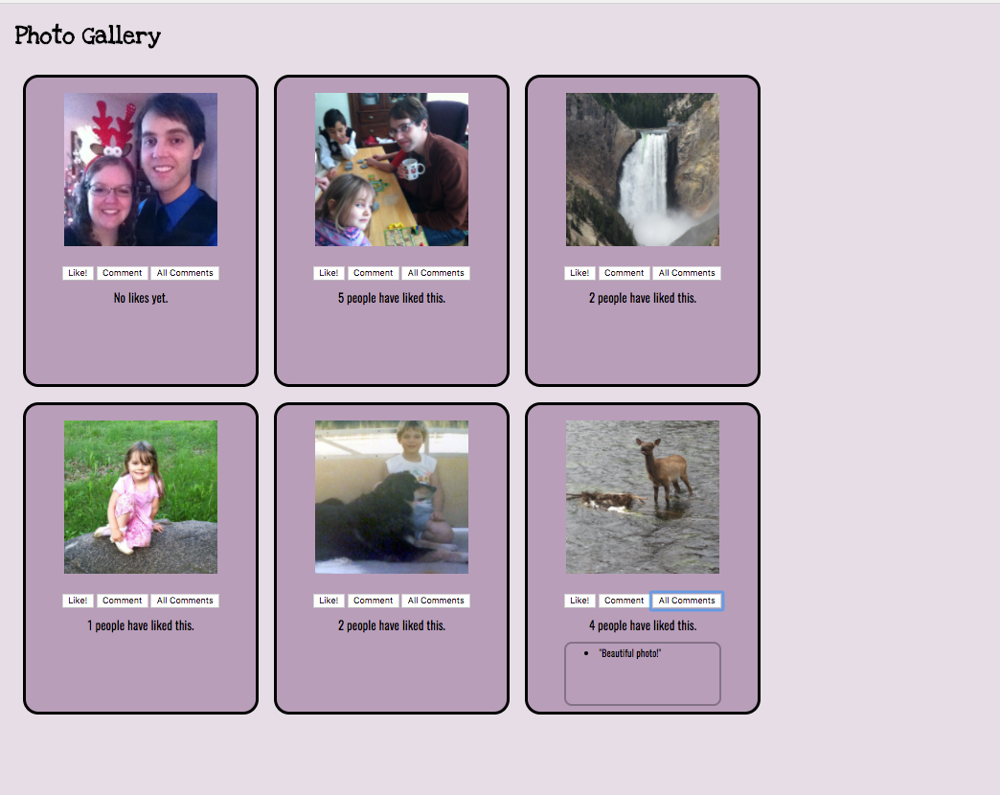

# ng Photo Gallery
This app consists of a gallery of photos that users can view, "like", or comment on. Users can click on a photo to view a description, "like" a photo, post a comment, or view all comments.
This app was built with JavaScript, AngularJS, Node.js and custom CSS styling.

<a href="https://ng-photo-gallery.herokuapp.com/">Demo version of app</a>

<p>


</p>

### Technology used
JavaScript, AngularJS, Node.js and custom CSS styling. Focus on using AngularJS $http calls to read and update data.

### Getting Started
Requires node. Run ```npm install``` in terminal.

### Future features
* Store images and comments on database.
* Create feature to upload additional photos.
* Create feature to delete photos.

### Author
Mike Pettman